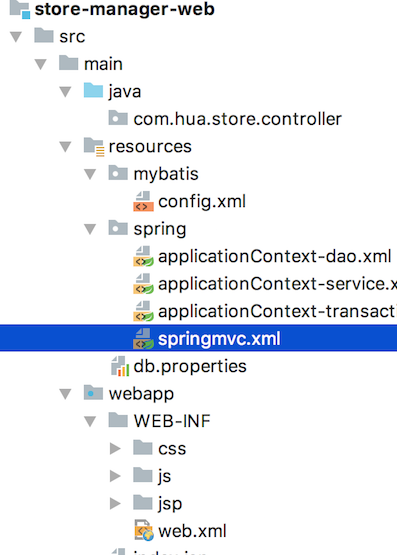

# Hua - Store

An e-commerce store designed by Hua, and just for fun using some java8 technology, solr, redis cluster, nginx.

## Background

E-commerce website is popular in nowadays market, especially in China. In order to make myself competent, I need to learn how to build a e-commerce website from scrach.

## Agenda

| DAYS | Agenda                                                       | Finished | Date                               |
| ---- | ------------------------------------------------------------ | :------: | ---------------------------------- |
| 1    | Background, history, now and future. Setup maven project, GitHub repo created. |    ✅     | 04/18/2018, 04/19/2018, 04/19/2018 |
| 2    | Framework intergration. Products list implemetation, paganation. |    ✅     | 04/21/2018, 04/22/2018, 04/23/2018 |
| 3    | Backend service management. Add product, image upload.       |          | 04/24/2018, 04/25/2018             |
| 4    | Product regulation?                                          |          |                                    |
| 5    | Product front end, display page.                             |          |                                    |
| 6    | cms implementation. Ad display.                              |          |                                    |
| 7**  | Add cache, Redis, cache synchornaztion.                      |          |                                    |
| 8*   | Search function. Implement by solr.                          |          |                                    |
| 9    | Product detail page.                                         |          |                                    |
| 10   | Shared session.                                              |          |                                    |
| 11   | Shopping cart.                                               |          |                                    |
| 12** | Nginx                                                        |          |                                    |
| 13   | Redis cluster, solr cluster. System deployment.              |          |                                    |
| 14   | Wrap up                                                      |          |                                    |

## Features

- Backend: Product mangement, order managerment, category management, user management, publisher
- Frontend: User can register, login, broswer products, homepage and place an order
- Membership: Order history, bookmarked product, coupon code and groupon
- Order: Place, search, modify and order scheduler
- Seach: Prodct search function

## Tech Approach

- Spring, SpringMVC, Mybatis
- JSP, JSTL, jQuery, plugin, EasyUI, KindEditor
- Redis
- Solr
- httpClient
- Mysql
- Nginx
- Tomcat

## Maven 

| Pom Files     | Extension |
| ------------- | --------- |
| store-parent  | .pom      |
| store-common  | .jar      |
| store-manager | .pom      |

## Structure

store-parent

|— store-common

|— store-manager

​       |— com.hua.manager.web(.**war**)

​       |— com.hua.manager.service

​       |— com.hua.manager.mapper

​       |— com.hua.manager.pojo

Config:

```
// under store-manager, pom.xml
<build>
        <plugins>
            <plugin>
                <groupId>org.apache.tomcat.maven</groupId>
                <artifactId>tomcat7-maven-plugin</artifactId>
                <configuration>
                    <port>8080</port>
                    <path>/</path>
                </configuration>
            </plugin>
        </plugins>
    </build>
```

Run

```
// under store-manager
mvn clean install
mvn clean tomcat7:run
```

Framework: springMVC + spring + mybatis

### Database configuration, entity creation

1. create database: store
2. load init.sql(/scripts)
3. Reverse engineering -> db schema to java entity

**mvn clean install — plugin way**

```
<plugin>
                <groupId>org.mybatis.generator</groupId>
                <artifactId>mybatis-generator-maven-plugin</artifactId>
                <version>1.3.5</version>
                <configuration>
                    	<configurationFile>src/main/resources/generatorConfig.xml</configurationFile>
                    <verbose>true</verbose>
                    <overwrite>true</overwrite>
                </configuration>
                <executions>
                    <execution>
                        <id>Generate MyBatis Artifacts</id>
                        <goals>
                            <goal>generate</goal>
                        </goals>
                    </execution>
                </executions>
                <dependencies>
                    <dependency>
                        <groupId>org.mybatis.generator</groupId>
                        <artifactId>mybatis-generator-core</artifactId>
                        <version>1.3.5</version>
                    </dependency>
                    <dependency>
                        <groupId>mysql</groupId>
                        <artifactId>mysql-connector-java</artifactId>
                        <version>5.1.28</version>
                    </dependency>
                </dependencies>
            </plugin>
```

** java generator**

```
public void generator() throws Exception{
        List<String> warnings = new ArrayList<String>();
        boolean overwrite = true;
        File configFile = new File(SchemaToEntity.class.getClassLoader().getResource("generatorConfig.xml").getPath());

        ConfigurationParser cp = new ConfigurationParser(warnings);
        Configuration config = cp.parseConfiguration(configFile);
        DefaultShellCallback callback = new DefaultShellCallback(overwrite);
        MyBatisGenerator myBatisGenerator = new MyBatisGenerator(config,
                callback, warnings);
        myBatisGenerator.generate(null);
    }

    public static void main(String[] args) throws Exception {
        try {
            new SchemaToEntity().generator();
        } catch (Exception e) {
            e.printStackTrace();
        }
    }
```

Ref:

http://www.mybatis.org/generator/index.html

https://github.com/mybatis/generator/releases

### Integration SSM(SpringMVC, Spring, Mybatis)	

#### DAO Layer

Using mybatis framework, create *sqlMapConfig.xml*, *applicationContext-dao.xml*

1. Datasource configuration
2. SpingIoc manage *SqlSessionFactory*, singleton
3. Add mapper object to Springioc

#### Service Layer

1. Transaction management
2. Add service to SpringIoc

#### ViewModel Layer

1. Annotation configuration
2. ModelViewResolver configuration
3. Scan controller

#### Web.xml

1. SpringIoc configuration
2. SpringMvc configuration
3. Post encoding

#### Configurations - Under store-manager-web

##### *Config.xml*

```Xml
<?xml version="1.0" encoding="UTF-8" ?>
<!DOCTYPE configuration
        PUBLIC "-//mybatis.org//DTD Config 3.0//EN"
        "http://mybatis.org/dtd/mybatis-3-config.dtd">

    <plugins>
        <plugin interceptor="com.github.pagehelper.PageInterceptor">
            <!--<property name="dialect" value="mysql"/>-->
        </plugin>
    </plugins>
```

##### *ApplicationContext-dao.xml*

```
<?xml version="1.0" encoding="UTF-8" ?>

<beans xmlns="http://www.springframework.org/schema/beans"
       xmlns:context="http://www.springframework.org/schema/context" xmlns:p="http://www.springframework.org/schema/p"
       xmlns:aop="http://www.springframework.org/schema/aop" xmlns:tx="http://www.springframework.org/schema/tx"
       xmlns:xsi="http://www.w3.org/2001/XMLSchema-instance"
       xsi:schemaLocation="http://www.springframework.org/schema/beans http://www.springframework.org/schema/beans/spring-beans-4.0.xsd
	http://www.springframework.org/schema/context http://www.springframework.org/schema/context/spring-context-4.0.xsd
	http://www.springframework.org/schema/aop http://www.springframework.org/schema/aop/spring-aop-4.0.xsd http://www.springframework.org/schema/tx http://www.springframework.org/schema/tx/spring-tx-4.0.xsd
	http://www.springframework.org/schema/util http://www.springframework.org/schema/util/spring-util-4.0.xsd">

    <!-- Configuration file-->
    <context:property-placeholder location="classpath:db.properties" />

    <!-- Connection pool - druid -->
    <bean id="dataSource" class="com.alibaba.druid.pool.DruidDataSource"
          destroy-method="close">
        <property name="url" value="${jdbc.url}" />
        <property name="username" value="${jdbc.username}" />
        <property name="password" value="${jdbc.password}" />
        <property name="driverClassName" value="${jdbc.driver}" />
        <property name="maxActive" value="10" />
        <property name="minIdle" value="5" />
    </bean>

    <!-- Session Factory -->
    <bean id="sqlSessionFactory" class="org.mybatis.spring.SqlSessionFactoryBean">

        <property name="dataSource" ref="dataSource" />
        <!-- load mybatis global configuration -->
        <property name="configLocation" value="classpath:mybatis/config.xml" />
    </bean>

    <bean class="org.mybatis.spring.mapper.MapperScannerConfigurer">
        <property name="basePackage" value="com.hua.store.mapper" />
    </bean>
</beans>
```

##### *ApplicationContext-service.xml*

```
<?xml version="1.0" encoding="UTF-8" ?>

<beans xmlns="http://www.springframework.org/schema/beans"
       xmlns:context="http://www.springframework.org/schema/context" xmlns:p="http://www.springframework.org/schema/p"
       xmlns:aop="http://www.springframework.org/schema/aop" xmlns:tx="http://www.springframework.org/schema/tx"
       xmlns:xsi="http://www.w3.org/2001/XMLSchema-instance"
       xsi:schemaLocation="http://www.springframework.org/schema/beans http://www.springframework.org/schema/beans/spring-beans-4.0.xsd
	http://www.springframework.org/schema/context http://www.springframework.org/schema/context/spring-context-4.0.xsd
	http://www.springframework.org/schema/aop http://www.springframework.org/schema/aop/spring-aop-4.0.xsd http://www.springframework.org/schema/tx http://www.springframework.org/schema/tx/spring-tx-4.0.xsd
	http://www.springframework.org/schema/util http://www.springframework.org/schema/util/spring-util-4.0.xsd">

    <context:component-scan base-package="com.hua.store.service"/>

</beans>
```

##### *ApplicationContext-transaction.xml*

```
<beans xmlns="http://www.springframework.org/schema/beans"
       xmlns:context="http://www.springframework.org/schema/context" xmlns:p="http://www.springframework.org/schema/p"
       xmlns:aop="http://www.springframework.org/schema/aop" xmlns:tx="http://www.springframework.org/schema/tx"
       xmlns:xsi="http://www.w3.org/2001/XMLSchema-instance"
       xsi:schemaLocation="http://www.springframework.org/schema/beans http://www.springframework.org/schema/beans/spring-beans-4.0.xsd
	http://www.springframework.org/schema/context http://www.springframework.org/schema/context/spring-context-4.0.xsd
	http://www.springframework.org/schema/aop http://www.springframework.org/schema/aop/spring-aop-4.0.xsd http://www.springframework.org/schema/tx http://www.springframework.org/schema/tx/spring-tx-4.0.xsd
	http://www.springframework.org/schema/util http://www.springframework.org/schema/util/spring-util-4.0.xsd">

    <bean id="transactionManager"
          class="org.springframework.jdbc.datasource.DataSourceTransactionManager">
        <property name="dataSource" ref="dataSource" />
    </bean>

    <tx:advice id="txAdvice" transaction-manager="transactionManager">
        <tx:attributes>
            <tx:method name="save*" propagation="REQUIRED" />
            <tx:method name="insert*" propagation="REQUIRED" />
            <tx:method name="add*" propagation="REQUIRED" />
            <tx:method name="create*" propagation="REQUIRED" />
            <tx:method name="delete*" propagation="REQUIRED" />
            <tx:method name="update*" propagation="REQUIRED" />
            <tx:method name="find*" propagation="SUPPORTS" read-only="true" />
            <tx:method name="select*" propagation="SUPPORTS" read-only="true" />
            <tx:method name="get*" propagation="SUPPORTS" read-only="true" />
        </tx:attributes>
    </tx:advice>

    <aop:config>
        <aop:advisor advice-ref="txAdvice"
                     pointcut="execution(* com.hua.store.service.*.*(..))" />
    </aop:config>
</beans>
```

##### *springmvc.xml*

```
<?xml version="1.0" encoding="UTF-8"?>
<beans xmlns="http://www.springframework.org/schema/beans"
       xmlns:xsi="http://www.w3.org/2001/XMLSchema-instance" xmlns:p="http://www.springframework.org/schema/p"
       xmlns:context="http://www.springframework.org/schema/context"
       xmlns:mvc="http://www.springframework.org/schema/mvc"
       xsi:schemaLocation="http://www.springframework.org/schema/beans http://www.springframework.org/schema/beans/spring-beans.xsd
        http://www.springframework.org/schema/mvc http://www.springframework.org/schema/mvc/spring-mvc-4.0.xsd
        http://www.springframework.org/schema/context http://www.springframework.org/schema/context/spring-context.xsd">

    <context:component-scan base-package="com.hua.store.controller" />
    
    <mvc:annotation-driven />
    <bean
            class="org.springframework.web.servlet.view.InternalResourceViewResolver">
        <property name="prefix" value="/WEB-INF/jsp/" />
        <property name="suffix" value=".jsp" />
    </bean>
    
    <!-- Static resources mapping -->
   <mvc:resources mapping="/css/**" location="/WEB-INF/css/"/>
   <mvc:resources mapping="/js/**" location="/WEB-INF/js/"/>
</beans>
```

##### *web.xml*

```
<!DOCTYPE web-app PUBLIC
        "-//Sun Microsystems, Inc.//DTD Web Application 2.3//EN"
        "http://java.sun.com/dtd/web-app_2_3.dtd" >

<web-app>

    <display-name>store-manager-web</display-name>
    <welcome-file-list>
        <welcome-file>login.html</welcome-file>
    </welcome-file-list>

    <!-- Load spring continer -->
    <context-param>
        <param-name>contextConfigLocation</param-name>
        <param-value>classpath:spring/applicationContext-*.xml</param-value>
    </context-param>
    <listener>
        <listener-class>org.springframework.web.context.ContextLoaderListener</listener-class>
    </listener>

    <!-- post encoding -->
    <filter>
        <filter-name>CharacterEncodingFilter</filter-name>
        <filter-class>org.springframework.web.filter.CharacterEncodingFilter</filter-class>
        <init-param>
            <param-name>encoding</param-name>
            <param-value>utf-8</param-value>
        </init-param>
    </filter>
    <filter-mapping>
        <filter-name>CharacterEncodingFilter</filter-name>
        <url-pattern>/*</url-pattern>
    </filter-mapping>

    <!-- springmvc -->
    <servlet>
        <servlet-name>store-manager</servlet-name>
        <servlet-class>org.springframework.web.servlet.DispatcherServlet</servlet-class>
       <init-param>
            <param-name>contextConfigLocation</param-name>
            <param-value>classpath:spring/springmvc.xml</param-value>
        </init-param>
        <load-on-startup>1</load-on-startup>
    </servlet>
    <servlet-mapping>
        <servlet-name>store-manager</servlet-name>
        <!-- intercept all requests, include static resources-->
        <url-pattern>/</url-pattern>
    </servlet-mapping>
</web-app>
```

tt

#### Resource

- item/list
  - Parameters - http://localhost:8080/item/list?page=1&rows=30
  - Response -EasyUI datagrid component requires Json format : ***{total: 2, rows:[{"id":1, "name": "zhangsan"},{"id":2, "name": "lisi"}]}***

#### MyBatis PageHelper

MyBatis SqlSessionFactory

​                    |

​            Sql Session

​                    |

​              Exectuor

​                    |      --> MyBatis plugin implements Interceptor interface. Using *LIMIT* in sql statement.

​        MappedStatment

PageHelper.startPage(PAGE_NUM, PAGE_SIZE)

#### Image upload

- Tomcat cluster
- Image server - user upload images, http request
  - Need a http server - e.g. apache, **nginx**
  - Use ftp service to upload image - linux bundled ftp server: **vsftpd**


## Reference

mvc:resources - https://docs.spring.io/spring/docs/3.0.x/spring-framework-reference/html/mvc.html#mvc-static-resources

mybatis page helper - https://github.com/pagehelper/Mybatis-PageHelper/blob/master/wikis/en/HowToUse.md

easyui的datagrid對應的java對象 - https://hk.saowen.com/a/a2afa859baee4c35d5ee46363513d2630a5bfd7259564334480affa4c6546ee2

## TroubleShoot

java.lang.ClassNotFoundException: com.fasterxml.jackson.core.JsonProcessingException - https://blog.csdn.net/RyanDYJ/article/details/76687161

PageHelper Cannot cast to Interceptor. #48 - https://github.com/pagehelper/Mybatis-PageHelper/issues/48

